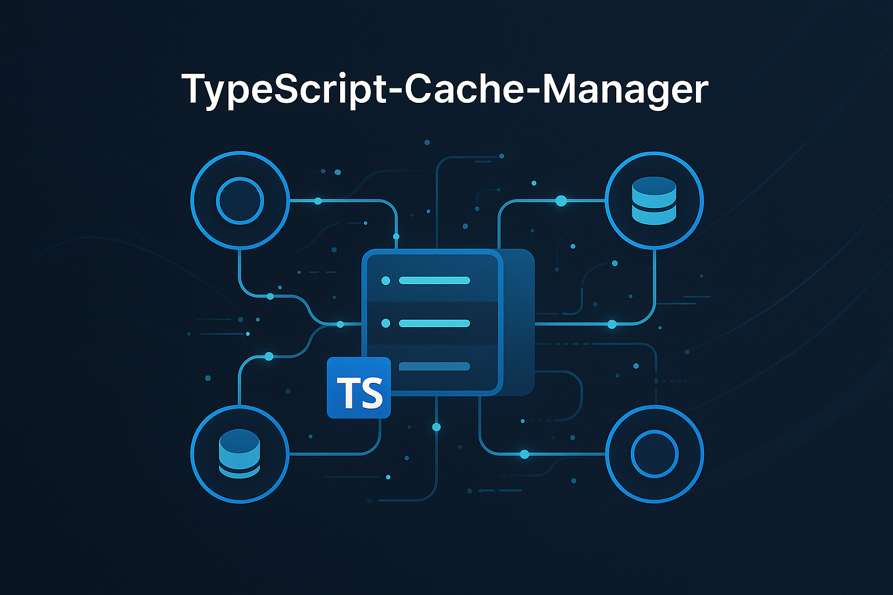

# TypeScript-Cache-Manager



**Distributed Cache Management System**

Built with TypeScript by Gabriel Demetrios Lafis.

## English

This project, **TypeScript-Cache-Manager**, is a robust and efficient distributed cache management system built entirely with TypeScript. It provides a flexible and scalable solution for managing cached data across various applications and services.

### Features

*   **Distributed Caching:** Seamlessly manage cache across multiple nodes.
*   **High Performance:** Optimized for speed and efficiency.
*   **Type-Safe:** Leverages TypeScript for enhanced code quality and maintainability.
*   **Extensible:** Easily integrate with different caching strategies and storage solutions.

### Quick Start

To get started with TypeScript-Cache-Manager, follow these steps:

```bash
npm install
npm run build
npm start
```

### Author

Gabriel Demetrios Lafis

## Português

Este projeto, **TypeScript-Cache-Manager**, é um sistema de gerenciamento de cache distribuído robusto e eficiente, construído inteiramente com TypeScript. Ele oferece uma solução flexível e escalável para gerenciar dados em cache em diversas aplicações e serviços.

### Funcionalidades

*   **Cache Distribuído:** Gerencie o cache de forma transparente em múltiplos nós.
*   **Alta Performance:** Otimizado para velocidade e eficiência.
*   **Segurança de Tipo:** Utiliza TypeScript para maior qualidade e manutenibilidade do código.
*   **Extensível:** Fácil integração com diferentes estratégias de cache e soluções de armazenamento.

### Início Rápido

Para começar a usar o TypeScript-Cache-Manager, siga estes passos:

```bash
npm install
npm run build
npm start
```

### Autor

Gabriel Demetrios Lafis

